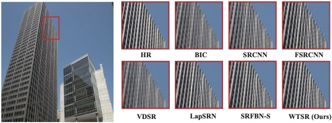

---

##### Download

+ [Paper](paper.pdf)
+ [Code and data](https://github.com/JinyeRAN/WTSR)

---

##### Abstract

Suffering from the inefficiency of deeper and wider networks, most remarkable super-resolution algorithms cannot be easily applied to real-world scenarios, especially resource-constrained devices. In this paper, to concentrate on fewer parameters and faster inference, an end-to-end Wavelet-based Transformer for Image Super-resolution (WTSR) is proposed. Different from the existing approaches that directly map low-resolution (LR) images to high-resolution (HR) images, WTSR also implicitly mines the self-similarity of image patches by a lightweight Transformer on the wavelet domain, so as to balance the model per- formance and computational cost. More specifically, a two-dimensional stationary wavelet transform is designed for the mutual transformation between feature maps and wavelet coefficients, which reduces the difficulty of mining self-similarity. For the wavelet coefficients, a Lightweight Transformer Backbone (LTB) and a Wavelet Coefficient Enhancement Backbone (WECB) are proposed to capture and model the long-term dependency between image patches. Furthermore, a Similarity Matching Block (SMB) is investigated to combine global self-similarity and local self-similarity in LTB. Experimental results show that our proposed approach can achieve better super-resolution performance on the multiple public benchmarks with less computational complexity


---

##### Figure 1: The network of the proposed wavelet-based Transformer for super-resolution


##### Figure 7: Subjective visual quality compared with other super-resolution networks



---

##### Citation

Ran, Jinye, and Zili Zhang. "Lightweight wavelet-based transformer for image super-resolution." Pacific rim international conference on artificial intelligence. Cham: Springer Nature Switzerland, 2022.

```BibTeX
@inproceedings{ran2022lightweight,
  title={Lightweight wavelet-based transformer for image super-resolution},
  author={Ran, Jinye and Zhang, Zili},
  booktitle={Pacific rim international conference on artificial intelligence},
  pages={368--382},
  year={2022},
  organization={Springer}
}
```

---

##### Related material

+ [Presentation slides](presentation.pdf)
