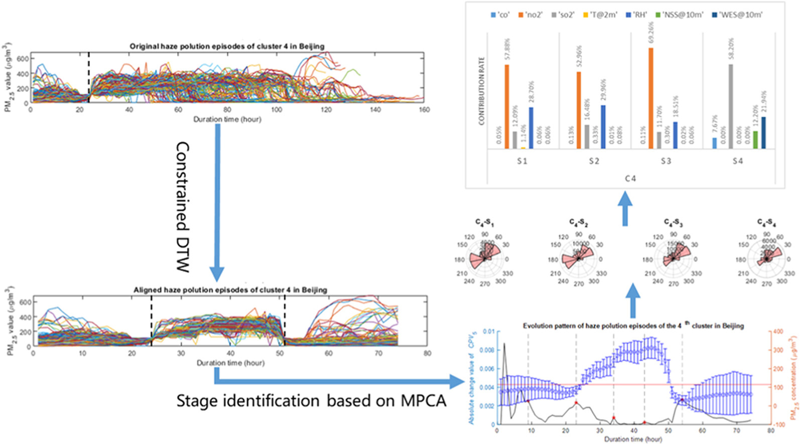
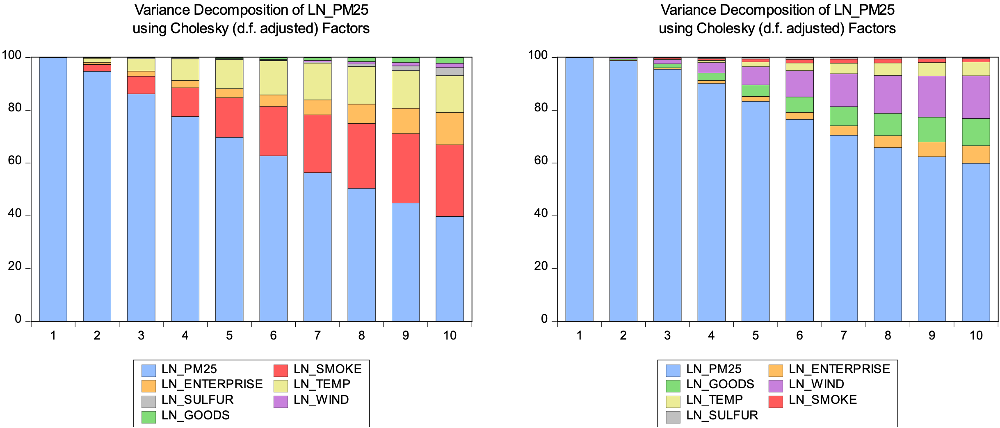

This project falls under the domain of data analysis, with a focus on uncovering key patterns within pollutant time-series data. 

## Identify key contamination patterns
Modeling and analysis of time-series data by decomposing it into trend and cyclical components to uncover underlying patterns. Spatial-temporal clustering techniques are applied to investigate the latent relationships among data from different regions.

## Explore the relationships between patterns and other factors
Econometric models are employed to examine the characteristics of pollutant variation in relation to external factors, including macroeconomic and meteorological variables, in an effort to interpret the findings from the spatial-temporal clustering analysis.

##### Figure 1: Applied vector error correction models to examine the relationships between pollutant concentrations and meteorological as well as economic factors.

##### Related material
+ [Code](https://github.com/Pau0031/Evolution-Pattern-Analysis-of-Haze-Pollution-Episodes)
+ [Data](https://data.cma.cn/)