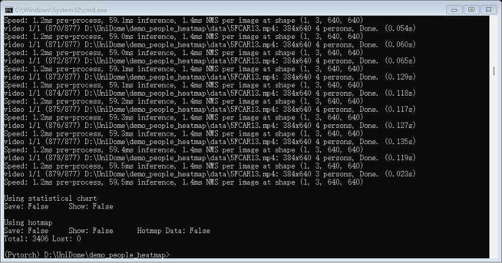
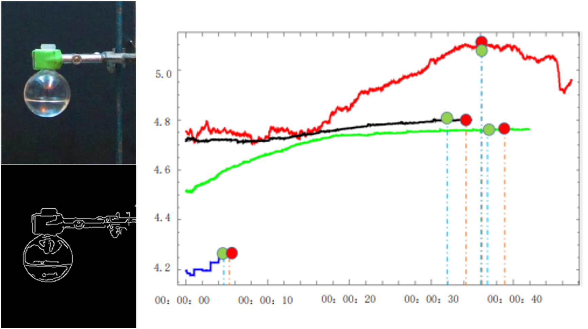
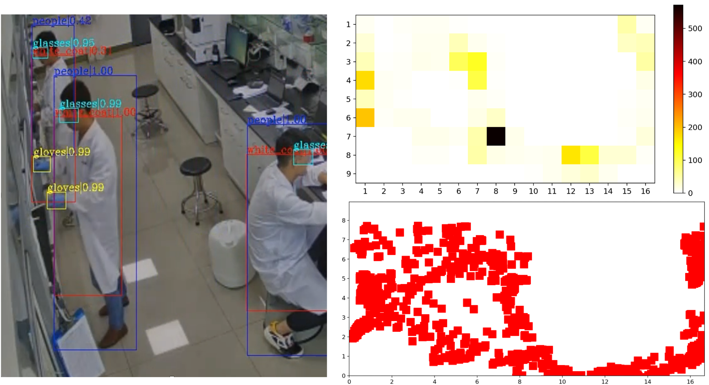

This project focuses on the development of a **large-scale** and **systematic** laboratory monitoring system, built upon a suite of advanced computer vision algorithms. The system integrates personnel safety behavior detection, multi-scenario safety monitoring, chemical experiment status tracking, as well as front-end interface design and back-end live streaming functionality.

##### Figure 1: Chemical experiment status tracking. The green dot is the actual end time of the experiment, and the red dot is the end time of the experiment detected by the algorithm

##### Figure 2: Personnel locating and wear detection

As a core contributor to this project, my primary responsibilities include the development of visual detection and tracking algorithms, alongside the optimization, acceleration, and deployment of deep neural networks. Additionally, I developed a robust back-end system for real-time live streaming.

By leveraging TensorRT to accelerate certain operators within the deep neural networks, the system ultimately achieved real-time processing of **12 video streams on a single NVIDIA T4 GPU**.