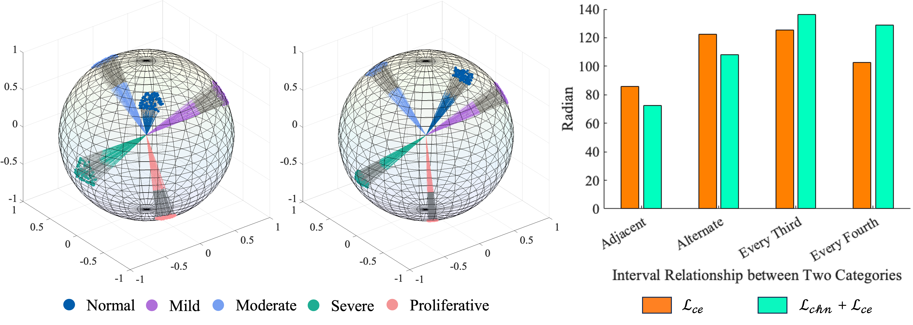
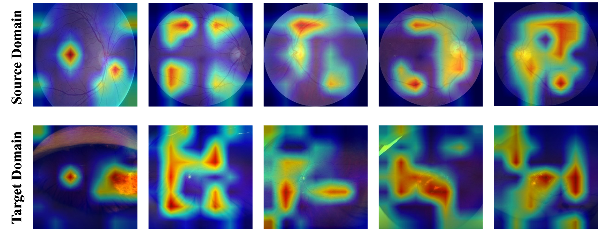

---

##### Download

+ [Paper](paper.pdf)
+ [Code and data](https://github.com/JinyeRAN/SFADA)

---

##### Abstract

Domain adaptation (DA) is commonly employed in diabetic retinopathy (DR) grading using unannotated fundus images, allowing knowledge transfer from labeled color fundus images. Existing DAs often struggle with domain disparities, hindering DR grading performance compared to clinical diagnosis. A source-free active domain adaptation method (SFADA), which generates features of color fundus images by noise, selects valuable ultra- wide-field (UWF) fundus images through local representation matching, and adapts models using DR lesion prototypes, is proposed to upgrade DR diagnostic accuracy. Importantly, SFADA enhances data security and patient privacy by excluding source domain data. It reduces image resolution and boosts model training speed by modeling DR grade relationships directly. Experiments show SFADA significantly improves DR grading performance, increasing accuracy by 20.90% and quadratic weighted kappa by 18.63% over baseline, reaching 85.36% and 92.38%, respectively. This suggests SFADA’s promise for real clinical applications.

---

##### Figure 1: The flowchart of the proposed source-free active domain adaptation


##### Figure 2: Visualization of source domain feature in the hyper-sphere



##### Figure 4: Visualization of the regions attended by the source pre-trained model in the source domain and the regions attended by the adapted model in the target domain



---

##### Citation

Ran, Jinye, et al. "Source-free active domain adaptation for diabetic retinopathy grading based on ultra-wide-field fundus images." Computers in Biology and Medicine 174 (2024): 108418.

```BibTeX
@article{ran2024source,
  title={Source-free active domain adaptation for diabetic retinopathy grading based on ultra-wide-field fundus images},
  author={Ran, Jinye and Zhang, Guanghua and Xia, Fan and Zhang, Ximei and Xie, Juan and Zhang, Hao},
  journal={Computers in Biology and Medicine},
  volume={174},
  pages={108418},
  year={2024},
  publisher={Elsevier}
}
```