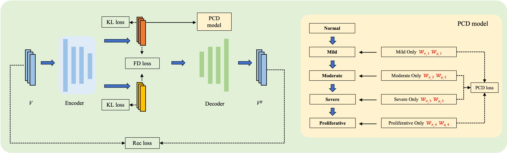
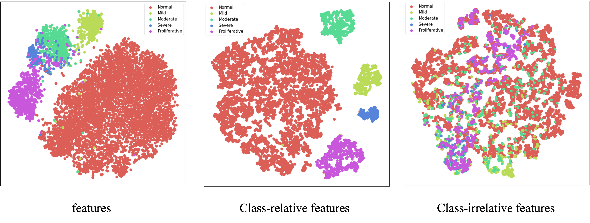
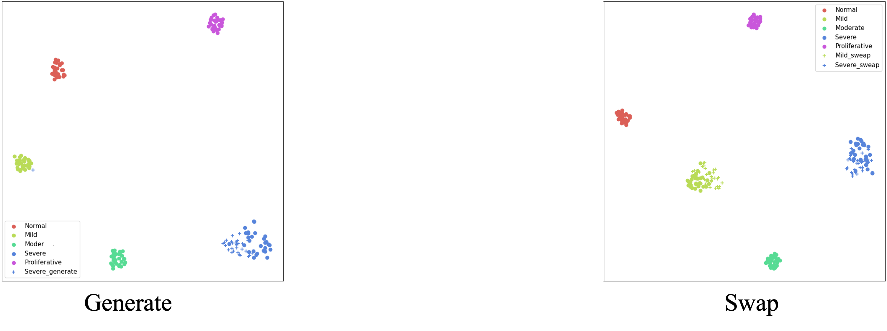

---

##### Overview

This is an ongoing research project in which we have successfully disentangled class-relevant and class-irrelevant features from ultra-wide-field fundus images of diabetic retinopathy. The effectiveness of the disentangled features has been validated through feature swapping, feature generation, and downstream classification tasks. Partial results have been consolidated into the patent titled ‘A Method for Decoupling Diabetic Retinopathy Features in Ultra-Wide-Field Fundus Images’.

---

##### Figure 1: Flowchart Depicting the Proposed Feature Disentanglement Method

##### Figure 2: Class-relevant and class-irrelevant features visualized through t-SNE

##### Figure 4: t-SNE visualization of the feature swapping and disentangled generation results

---