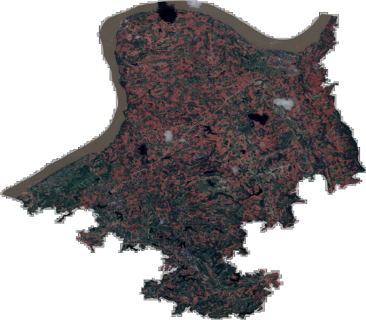
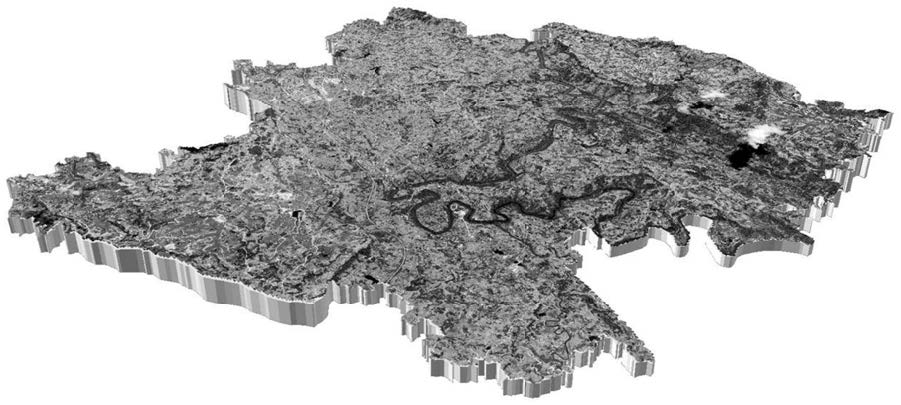

This research project focuses on the practical application of semantic segmentation algorithms for crop yield estimation in remote sensing, specifically targeting the Pericarpium Zanthoxyli. It consists of two main components: **model development** and **model evaluation**.

## Model Development

Participated in field surveys for crop observation using remote sensing images and drafted pixel-level annotation standards for Pericarpium Zanthoxyli. Additionally, led the dataset development. 

Optimized the performance of semantic segmentation algorithms, such as SegNet, U-Net, and Mask R-CNN, for remote sensing applications. Then, trained and deployed the Pericarpium Zanthoxyli segmentation model.

## Model Evaluation
The performance of the trained Pericarpium Zanthoxyli segmentation model was comprehensively evaluated through both a validation dataset and field verification, achieving a mean Intersection over Union (mIoU) of over 90%. 

The results included visualizations of 2D semantic segmentation for Pericarpium Zanthoxyli and 3D segmentation visualizations across two towns.

##### Figure 1: 3D visualization

The model has been practically deployed to estimate the yield of Pericarpium Zanthoxyli over an area exceeding 1,200 square miles, with a patent authorized for the underlying technology.

##### Related material
+ [Granted Patent](https://patents.google.com/patent/CN112906627A/en?q=(Green+pricklyash+peel+identification+method+based+on+semantic+segmentation)&oq=Green+pricklyash+peel+identification+method+based+on+semantic+segmentation)